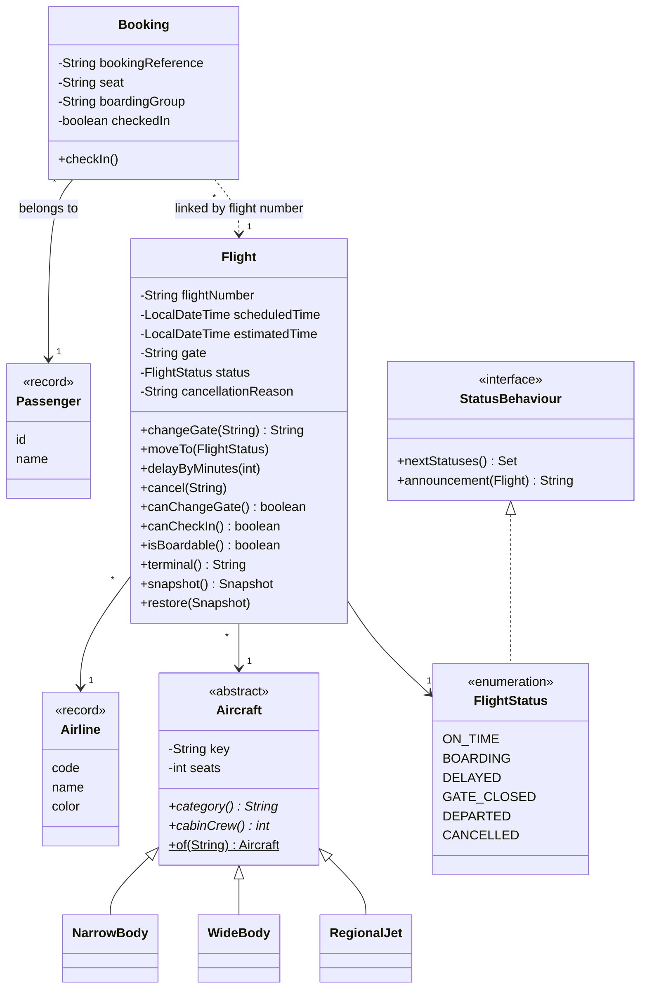
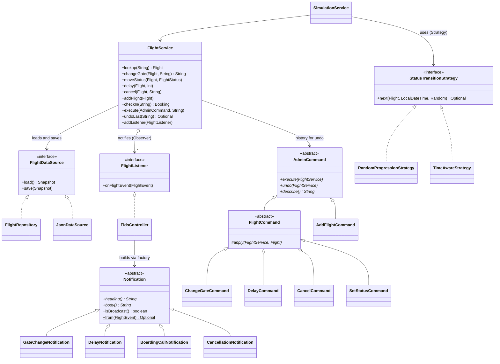
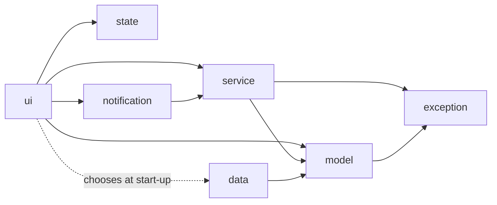
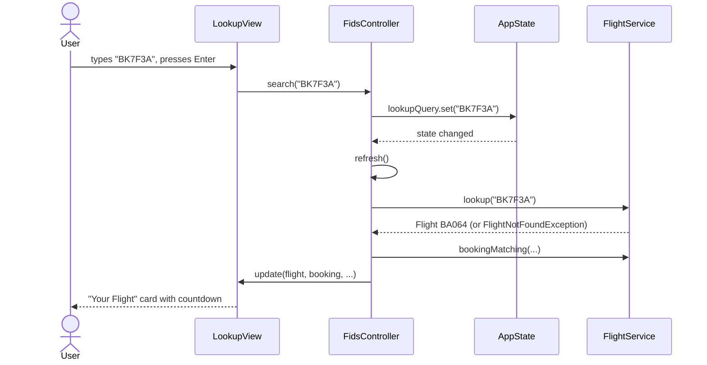
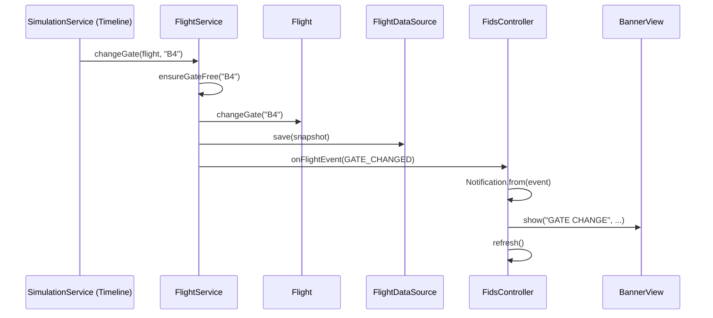
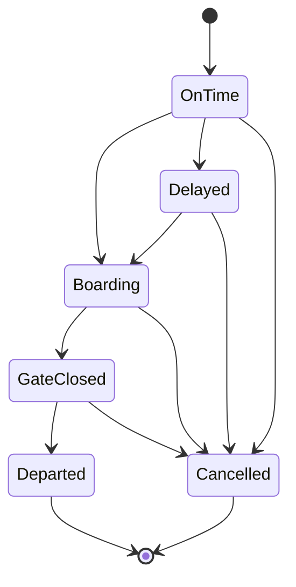

# UML diagrams

All diagrams are [Mermaid](https://mermaid.js.org/), which GitHub renders directly. Paste the code blocks into
<https://mermaid.live> to export them as images for the report.

## 1. Domain model (class diagram)

## 2. Service layer and patterns (class diagram)

Patterns used: **Observer** (`FlightListener`), **Strategy** (`StatusTransitionStrategy`, `SortKey` comparators,
`FlightDataSource`), **Command + Memento** (`AdminCommand`, `Flight.Snapshot`), **Template Method**
(`FlightCommand.execute`), **Factory** (`Notification.from`, `Aircraft.of`), **MVC/MVP** (views, `FidsController`,
`AppState`).

## 3. Package diagram

## 4. Sequence: user searches for a flight

## 5. Sequence: simulation changes a gate and the banner appears

## 6. State diagram: flight status lifecycle

Staff can also force any status (`SetStatusCommand`), bypassing these rules.
